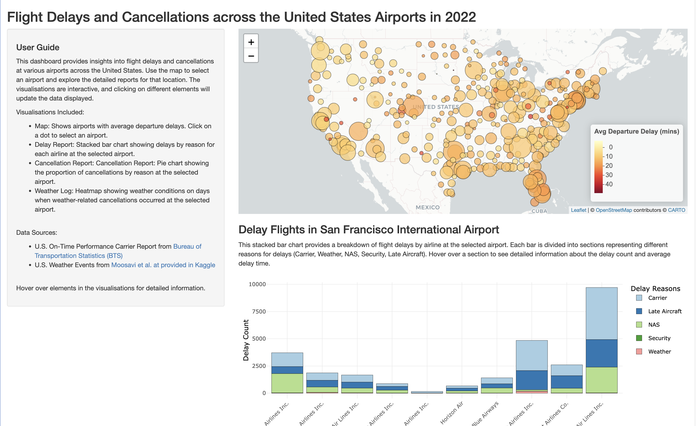

# Flight Delay & Cancellation Data Visualization

This project analyzes flight delays and cancellations across major U.S. airports using interactive data visualization.

## Project Overview

The project integrates aviation performance data with weather datasets to identify disruption patterns and causes of delays.

The final output is an interactive dashboard built using R Shiny.

## Technologies

- Python (data wrangling)
- R Shiny
- ggplot2
- Plotly
- Leaflet

## Key Features

- Interactive map of U.S. airports
- Delay reasons by airline
- Flight cancellation breakdown
- Weather event impact visualization

## Data Sources

- US Bureau of Transportation Statistics
- US Weather Events Dataset (Kaggle)

## Dashboard Preview

## Author

Lutfi Muzzaki Khairullah
